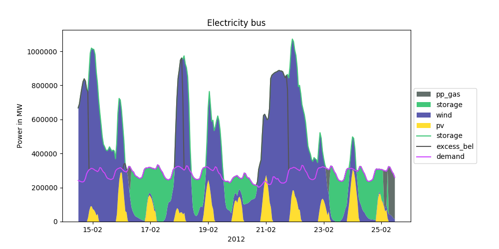

oemof's visualisation package.

Installation
============

Use pypi to install the latest version.

.. code:: bash

  pip install git+https://github.com/oemof/oemof_visio.git

Example (scientifically correct)
================================

.. image:: docs/io_plot.png

Example (smooth)
================

