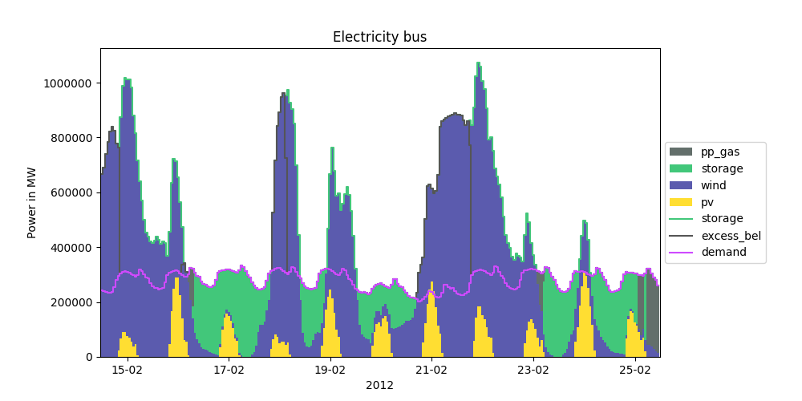

**oemof's visualisation package**   |badge|

.. |badge| image:: https://github.com/oemof/oemof-visio/blob/master/docs/mit_badge.svg
   :target: https://opensource.org/licenses/MIT

Installation
============

Use pypi to install the latest version.
You can install the version just to plot graphs on oemof-solph results with

.. code:: bash

  pip install oemof.visio

or you can install the extra requirements to also produce an image of the energy system

.. code:: bash

  pip install oemof.visio[network]

You can also clone this repository and install locally with

.. code:: bash

  pip install .

or

.. code:: bash

  pip install .[network]

Special for Windows in case of optional `network` setting: download Graphviz (https://graphviz.org/download/) install it on your system -> activate "add PATH" variables during installation process otherwise the executable cannot be found. Afterwards, restart your environment.

Examples
========

Have a look at the plotting examples at the
`'oemof_example' repository <https://github.com/oemof/oemof_examples>`_ to
learn how to create the following examples.

(scientifically correct)
------------------------

(smooth)
--------

.. image:: docs/io_plot_smooth_pre.png

Render energy system
--------------------

To render the component of an energy system, you can insert this code before you turn your EnergySytem instance into a model (not well suited for very large models).

.. code:: python

    from oemof.visio import ESGraphRenderer
    esgr = ESGraphRenderer(
        <your EnergySystem instance>,
        legend=True,
        filepath="full path including filename without extension",
        img_format="pdf"
    )
    esgr.render()

Sankey diagramm
---------------

To produce a sankey diagramm from the raw oemof-solph results you can use this code snippet into your own model file

.. code:: python

    import plotly.io as pio

    from oemof.visio import ESGraphRenderer
    esgr = ESGraphRenderer(<your EnergySystem instance>)

    # after the solve method of the model has been called
    results = solph.processing.results(model)
    fig_dict = esgr.sankey(results)
    pio.show(fig_dict)

